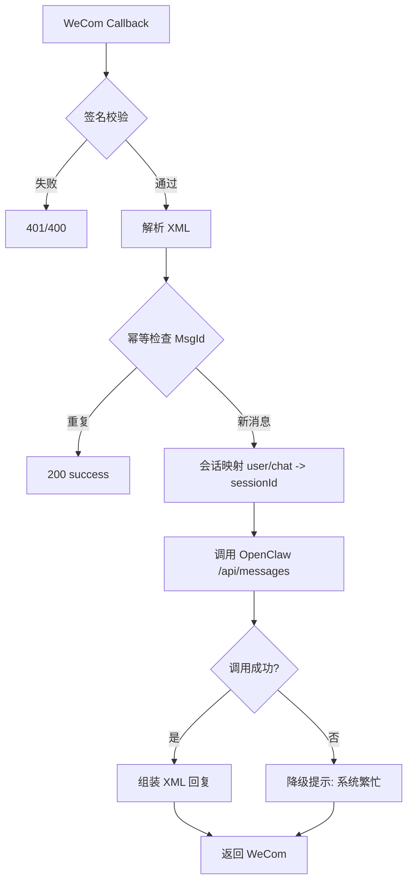

# OpenClaw ↔ WeCom Bridge 架构设计（MVP）

## 1. 系统架构
- **企业微信（WeCom）**：向桥接服务推送回调（URL 验证、用户消息）
- **Bridge 服务（本项目）**：验签、解析消息、幂等检查、会话映射、调用 OpenClaw、回包
- **OpenClaw API**：接收 `sessionId + text`，返回回复文本
- **会话映射存储（文件）**：`session-map.json`（MVP 先用静态文件）

## 2. 消息流
1. WeCom 回调 `GET /wecom/callback` 做 URL 验证。
2. WeCom 回调 `POST /wecom/callback` 推送消息 XML。
3. Bridge 验签（`msg_signature/timestamp/nonce`）并解析 XML。
4. 根据 `MsgId` 做幂等去重。
5. 根据 `FromUserName/ChatId` 映射到 OpenClaw `sessionId`。
6. 调用 OpenClaw `/api/messages`。
7. 将 OpenClaw 结果封装成 WeCom XML 同步回复。

## 3. 鉴权
- **WeCom -> Bridge**：基于 token 的 SHA1 签名校验。
- **Bridge -> OpenClaw**：Bearer Token（`OPENCLAW_API_KEY`）。

## 4. 重试策略
- OpenClaw 调用失败时对 5xx / 网络错误做指数退避重试：
  - base: `OPENCLAW_RETRY_BASE_MS`
  - max: `OPENCLAW_RETRY_MAX`

## 5. 幂等
- 使用内存 TTL map 按 `MsgId`（或 `FromUserName-CreateTime` 回退键）去重。
- 避免 WeCom 重试推送导致重复调用 OpenClaw。

## 6. 会话映射
- 键规则：
  - 单聊：`user:<FromUserName>`
  - 群聊：`chat:<ChatId>`
- 映射来源：`session-map.json`，找不到则回退键本身作为 sessionId。

## 7. 错误处理
- 验签失败：返回 `401`。
- 参数缺失：返回 `400`。
- OpenClaw 调用失败：返回 WeCom 文本“系统繁忙，请稍后重试”。
- 非文本消息：返回 success（忽略）。

## 8. 安全边界
- 不保存长期明文消息（仅日志中记录必要字段）。
- `OPENCLAW_API_KEY`、WeCom 凭据通过环境变量注入。
- 建议反向代理层开启 HTTPS 与来源白名单。

## 9. 部署拓扑（最小）
- `WeCom -> HTTPS(LB/Nginx) -> Bridge(Container) -> OpenClaw`
- Bridge 可横向扩容；幂等存储在 MVP 为单实例内存，生产建议迁移 Redis。

## 10. Mermaid 流程图

